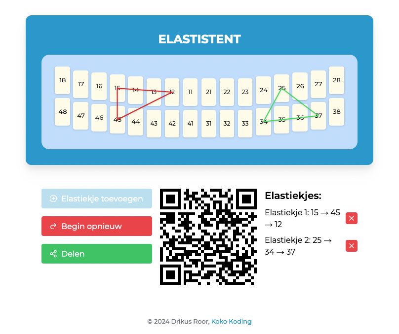

# Elastistent



Elastistent is a web application designed to help orthodontists and dental professionals visualize and plan elastic band placements for dental treatments. The app provides an interactive dental chart where users can place, visualize, and share elastic band configurations.

## 🔗 Live Demo

Try the application at: [https://drikusroor.github.io/elastistent/](https://drikusroor.github.io/elastistent/)

## ✨ Features

- Interactive dental chart with anatomically correct tooth positioning
- Visual elastic band placement between teeth
- Shareable configurations via URL
- QR code generation for easy sharing
- Mobile-responsive design
- Undo/redo functionality
- Real-time visualization
- Configuration persistence through URL parameters

## 🛠️ Tech Stack

- React 18
- TypeScript
- Vite
- Tailwind CSS
- Lucide React (icons)
- QRCode.react (QR code generation)

## 🚀 Getting Started

### Prerequisites

- Node.js (v14 or higher) or Bun runtime
- npm, yarn, or bun

### Installation

1. Clone the repository
```bash
git clone https://github.com/drikusroor/elastistent.git
cd elastistent
```

2. Install dependencies
```bash
# Using npm
npm install

# Using yarn
yarn install

# Using bun
bun install
```

3. Start the development server
```bash
# Using npm
npm run dev

# Using yarn
yarn dev

# Using bun
bun dev
```

4. Open your browser and navigate to `http://localhost:5173`

## 🏗️ Building for Production

To create a production build:

```bash
# Using npm
npm run build

# Using yarn
yarn build

# Using bun
bun run build
```

## 🤝 Contributing

Contributions are welcome! Feel free to submit issues and pull requests.

## 📝 License

Copyright © 2024 Drikus Roor, [Koko Koding](https://kokokoding.nl)